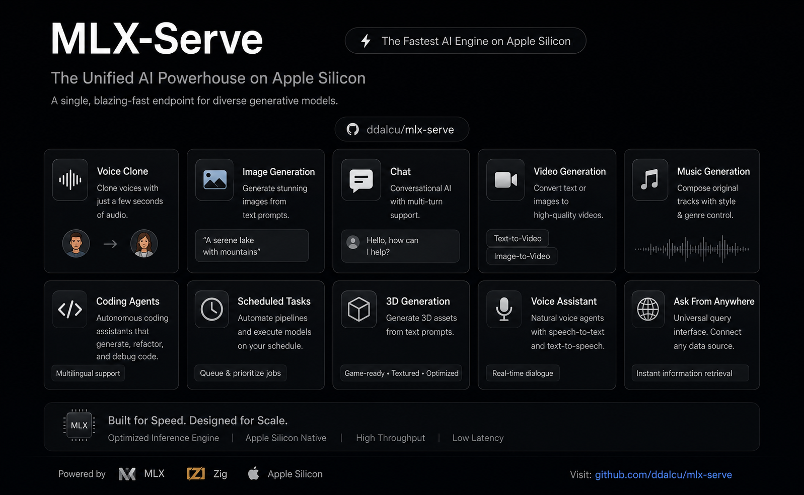
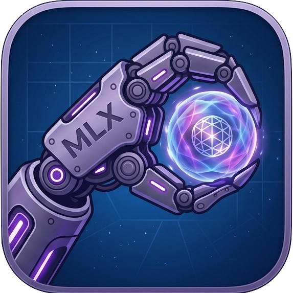
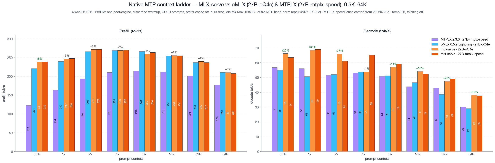
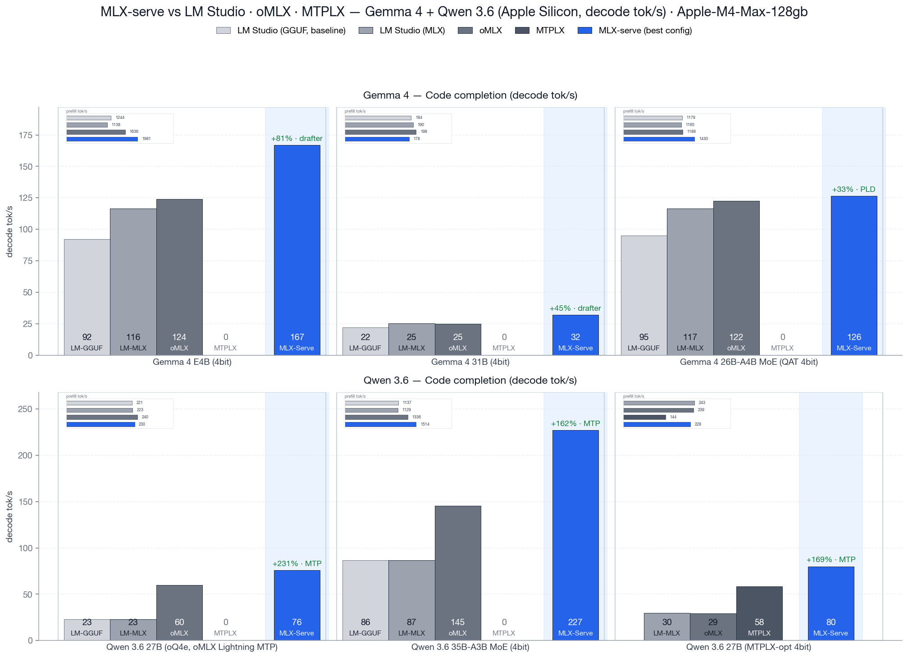

# mlx-serve — run any LLM on your Mac

**OpenAI- and Anthropic-compatible local inference for Apple Silicon — MLX *and* GGUF — faster than LM Studio on identical MLX weights. No Python. No cloud. No Electron.**

[](https://github.com/ddalcu/mlx-serve/releases/latest)
[](https://github.com/ddalcu/mlx-serve/stargazers)
[](https://github.com/ddalcu/mlx-serve/releases)
[](https://github.com/ddalcu/mlx-serve/commits/main)
[](LICENSE)
[](https://github.com/ddalcu/mlx-serve/releases/latest)
[](https://ziglang.org)
[](https://trendshift.io/repositories/43025)

**[mlxserve.com](https://mlxserve.com/)** · [Download MLX Core.app](https://github.com/ddalcu/mlx-serve/releases/latest) · [Changelog](CHANGELOG.md)

mlx-serve is a native Zig server that runs **any LLM on Apple Silicon** — MLX-format models *and* every GGUF on HuggingFace (Qwen, Llama, Mistral, Gemma, DeepSeek V4 Flash, thousands more). It exposes **OpenAI-compatible** *and* **Anthropic-compatible** HTTP APIs out of the box, so the same `http://localhost:11234` works with Claude Code, the OpenAI SDK, Continue, Cursor, Open WebUI, and anything else that speaks one of those wires. Beyond text, the same server generates **images, video, music, speech (with voice cloning), and 3D models** — all natively on MLX. Ships with **MLX Core**, a macOS menu-bar app with chat, agent mode, MCP tool calling, and model management.

[](https://github.com/ddalcu/mlx-serve/releases/latest) **[Download MLX Core.app](https://github.com/ddalcu/mlx-serve/releases/latest)** — latest release for macOS (Apple Silicon)

### Install via Homebrew

```bash
brew tap ddalcu/mlx-serve https://github.com/ddalcu/mlx-serve
brew install --cask mlx-core   # GUI menu bar app
brew install mlx-serve          # CLI server only
```

Then, Ollama-style:

```bash
mlx-serve run gemma4        # downloads Gemma 4 E4B (4-bit), serves it, chats right in your terminal
mlx-serve pull qwen3.6:27b  # just download (resumable, straight from Hugging Face)
mlx-serve list              # what's on disk
mlx-serve serve             # serve everything you've pulled — models load on demand by name
```

Short names, `org/repo` HuggingFace ids, and `name:tag` all work. And because mlx-serve **speaks the Ollama API** (`/api/chat`, `/api/generate`, `/api/tags`, `/api/embed`, `/api/pull`, …) alongside OpenAI and Anthropic, your existing Ollama-connected tools — Raycast, Obsidian, Enchanted, Open WebUI, `ollama-python`/`js` — work unchanged: point them at `http://localhost:11234` and keep your workflow, on a faster engine.

## Why mlx-serve

If you're already on LM Studio, Ollama, or `mlx-lm` and wondering whether to switch — here's the short version, head-to-head:

| | mlx-serve | LM Studio | Ollama | mlx-lm |
|---|:---:|:---:|:---:|:---:|
| MLX models (native Apple) | ✅ | ✅ | ❌ | ✅ |
| GGUF models (llama.cpp) | ✅ **embedded** | ✅ | ✅ | ❌ |
| OpenAI-compatible API | ✅ | ✅ | partial | ❌ |
| Anthropic Messages API | ✅ | 🟡 partial² | ❌ | ❌ |
| Ollama API (drop-in for Ollama clients) | ✅ | ❌ | ✅ native | ❌ |
| `run <model>` CLI with auto-download + REPL | ✅ | ❌ | ✅ | ❌ |
| OpenAI Responses API + WebSockets | ✅ | 🟡 partial² | ❌ | ❌ |
| DeepSeek V4 Flash (284B) | ✅ via ds4 | ❌ | ❌ | ❌ |
| Speculative decoding (PLD + drafter + native MTP) | ✅ | ❌ | partial | drafter only |
| Decode speed (geomean vs LM Studio, identical weights) | **+48%** (MLX) | baseline | ~−15% (GGUF, est.¹) | +11% (MLX) |
| KV-cache quantization (4/8-bit + TurboQuant) | ✅ | ❌ | partial | ✅ |
| Continuous batching | ✅ | ❌ | ✅ | ❌ |
| Built-in agent loop + MCP client | ✅ 10 tools | ❌ | ❌ | ❌ |
| Sandboxed agent shell (isolated Linux VM) | ✅ | ❌ | ❌ | ❌ |
| LAN model sharing (use another Mac's models) | ✅ | ❌ | ❌ | ❌ |
| One-click launchers (Claude Code, OpenCode, Pi) | ✅ | ❌ | ❌ | ❌ |
| Python required at runtime | ❌ | ❌ | ❌ | ✅ |
| Native menu-bar app (no Electron) | ✅ | ❌ Electron | ❌ | ❌ |
| **Image generation + photo editing** | ✅ | ❌ | ❌ | ❌ |
| **Video generation** (text / image / audio → video) | ✅ | ❌ | ❌ | ❌ |
| **Speech + voice cloning** | ✅ | ❌ | ❌ | ❌ |
| **Music generation** | ✅ | ❌ | ❌ | ❌ |
| **3D generation** (image → textured 3D model) | ✅ | ❌ | ❌ | ❌ |
| License | MIT | proprietary | MIT | MIT |

¹ Ollama can't run MLX, so the comparison is GGUF-vs-GGUF. 
² Recent LM Studio builds ship Anthropic `/v1/messages` and OpenAI `/v1/responses` compatibility endpoints, with partial coverage of each surface — mlx-serve additionally implements e.g. the Responses WebSocket transport and `/v1/responses/compact`.

### Benchmarks (Apple M4 Max, 128 GB · identical weights · ctx=4096 · temp=0 · LM Studio 0.4.15)

**Same 4-bit MLX weights**, decode tok/s — raw single-stream speed plus mlx-serve's speculative-decode wins:

| Model | Workload | LM Studio | mlx-serve | mlx-serve + PLD | mlx-serve + Drafter / MTP |
|---|---|---:|---:|---:|---:|
| Gemma 4 E2B | Echo | 192.8 tok/s | 194.2 | **407 (+111%)** | 233 (+21%) |
| Gemma 4 E4B | Code | 118.8 | 117.9 | 119.9 | **194 (+64%)** |
| Qwen 3.6 27B | Code | 29.5 | 29.0 | 30.3 | **58.4 (+98%)** |
| Qwen 3.6 35B-A3B MoE | Echo | 103.0 | 130.0 (+26%) | **239 (+132%)** | 186 (+80%) |

Across 18 cells (best mlx-serve vs best LM Studio per model × workload, geomean): **+48%** — still **+38%** with native MTP excluded. Prefill on the same weights: 1.8–2.5× on the small Gemmas, +17–19% on the MoEs. Per-model breakdown and chart in [vs. LM Studio](#vs-lm-studio-http-vs-http).

## Features

- **Run any LLM** — every supported MLX architecture *and* the entire GGUF universe via embedded llama.cpp. DeepSeek V4 Flash runs through the dedicated [antirez/ds4](https://github.com/antirez/ds4) engine.
- **OpenAI-compatible API** — `/v1/chat/completions`, `/v1/completions`, `/v1/embeddings`, `/v1/models`, streaming SSE, tools, JSON-schema constrained decoding, logprobs.
- **OpenAI Responses API** — `/v1/responses` with `previous_response_id` chains, per-event `sequence_number`, the `/v1/responses/compact` opaque history blob, and a WebSocket transport on the same endpoint.
- **Anthropic Messages API** — `/v1/messages` works with Claude Code (`ANTHROPIC_BASE_URL=http://localhost:11234`) and the Anthropic SDK.
- **Ollama-compatible API** — `/api/chat`, `/api/generate`, `/api/tags`, `/api/show`, `/api/ps`, `/api/embed`, `/api/pull` speak the Ollama wire (NDJSON streaming, tool calls with object arguments, `thinking`, `format` JSON schemas, `name:latest` model names), so the whole Ollama client ecosystem works against mlx-serve unchanged.
- **Ollama-grade CLI** — `mlx-serve run gemma4` downloads (resumable), serves, and drops you into a streaming chat REPL; `pull` / `list` / `serve` manage a shared `~/.mlx-serve/models` store the GUI app uses too.
- **Speculative decoding** — PLD (model-agnostic n-gram lookup, on by default) + the Gemma 4 cross-attention drafter. Adaptive prompt-time and runtime gates keep novel-content workloads at parity; agentic code loops see up to 1.6×.
- **Native multi-token prediction (Qwen 3.5/3.6)** — checkpoints shipping a trained MTP sidecar (like [Qwen3.6-27B-4bit-MTP](https://huggingface.co/ddalcu/Qwen3.6-27B-4bit-MTP-MLX-Serve), or [MTPLX](https://github.com/youssofal/MTPLX)-published artifacts, loaded unmodified) speculate with the model's own head automatically: 3 drafts per round with a self-tuning depth controller, +15–26% on coding-agent loops, MoE sidecars (35B-A3B) supported. In a fresh head-to-head on the identical checkpoint and prompts, mlx-serve beats the reference MTP runtime on all 8 ladder cells from 0.5K to 64K context — decode +11–30% AND prefill ahead at all 8.
- **Long-context prefill that flies** — a custom flash-attention Metal kernel handles Gemma's sliding-window layers during prefill, skipping everything outside the attention window: 2.4× prefill (299 → 715 tok/s) on a ~100K-token prompt with *less* peak memory. Qwen 3.5/3.6 long prompts prefill in architecture-tuned chunks: ~5% faster with peak memory down ~9 GB on the 27B.
- **KV-cache quantization** — 4-bit / 8-bit / TurboQuant variants shrink KV memory ~4× / ~2× / further still, so 16K contexts fit on hardware that couldn't hold them dense.
- **Continuous batching** — `--max-concurrent N` batches decode requests through one forward pass for ~1.6× throughput at 4-way parallel.
- **LAN model sharing** — `--lan-share all` lets other Macs on your network run inference on this Mac's models; `--lan-discover` mirrors peers' models into `/v1/models` as `model@peer` and proxies requests transparently, so Claude Code on a MacBook chats with the Studio's 27B through plain `localhost`. Off by default, zero configuration (Bonjour), share list enforced server-side, and only inference is ever exposed.
- **Prefix cache** — shared system-prompt KV reuse across turns and across conversations. v26.5.7 adds an LRU of llama.cpp KV sessions so multi-doc agent loops stay warm.
- **Tokenize cache** — chat-template render + tokenize cached per request; the second hit on a long conversation is a memcpy. Warm TTFT 7.7× faster on 1.8K-token prompts.
- **Vision** — Gemma 4 SigLIP encoder; send images via `image_url` content blocks.
- **Reasoning / thinking** — full streaming of thinking tokens as `reasoning_content`.
- **No Python** — single Zig binary, no `pip`, no venv. The MLX Core app ships everything signed and notarized.

## MLX Core (macOS App)


Menu-bar app that wraps the server with a full UI:

- **Model browser** — download from HuggingFace with resumable transfers, auto-discovers LM Studio's existing model folder (`~/.lmstudio/settings.json`) so you don't re-download what's on disk, GGUF rows show a min–max RAM-estimate range.
- **Chat interface** — multi-session chat with markdown rendering. Drop in PDFs (PDFKit-extracted) or images alongside text.
- **Agent mode** — 10 built-in tools (shell, cwd, readFile, writeFile, editFile, searchFiles, listFiles, browse, webSearch, saveMemory) with automatic tool calling loop and a per-tool approval dialog (**Allow** / **Deny** / **Always allow this session**).
- **MCP client** — curated marketplace of stdio + HTTP MCP servers (GitHub, Azure DevOps, DBHub, Docker, Kubernetes, Playwright, Slack, Notion, Filesystem, Shell) plus your own from `~/.mlx-serve/mcp.json`.
- **Agent Sandbox** — flip one toggle and every agent shell command runs inside an isolated Linux VM built on Apple's Virtualization framework: boots in under a second, guest servers mirror to `localhost` live (an Express app on guest port 8080 is `http://localhost:8080` on your Mac), and a green shield in the toolbar shows when commands run isolated. Let the agent go wild — your Mac stays untouched.
- **⌃Space Quick Launcher** — a Spotlight-style prompt panel over any app: hit ⌃Space, ask, and the answer streams in from your local model. Follow-ups keep context; ⌘↩ hands the conversation off to the full chat window.
- **Hands-free Voice Mode** — say "Hey Loki" and just talk: on-device speech recognition (audio never leaves the Mac), spoken replies with barge-in interruption, and voice-driven agent tools — all from the menu bar with no window open.
- **LAN Sharing** — share chosen models with the other Macs in your house and use theirs: peers appear automatically, shared models show up in the tray and every generation pane as "model · peer", and requests stream to the Mac that hosts the weights — chat, image, speech, music, video, and 3D alike, with models loading on demand on the host. Per-model share checkboxes in Settings; prompts sent to a shared model run on (and are visible to) the hosting Mac.
- **Telegram bridge** — message your local model from your phone: no public URL, no port-forwarding, no cloud relay. Agent tools and scheduled tasks work remotely; the bot locks to the first chat that messages it.
- **Scheduled tasks** — hand the agent a goal and a schedule in plain English ("weekdays at 8am, check my watched sites and write a briefing") and it runs unattended, with saved transcripts.
- **Document folder RAG** — attach a folder of mixed files and ask questions about them; GPU-batched embeddings index ~500 files in ~7 s, everything in memory, nothing leaves the Mac.
- **Editable system prompt + persistent memory** — `~/.mlx-serve/system-prompt.md` and `~/.mlx-serve/memory.md`.
- **Prompt-based skills** — drop `.md` files into `~/.mlx-serve/skills/` with YAML frontmatter to teach the agent custom capabilities triggered by keywords.
- **Engine-aware Settings window** (Cmd+,) — every server-launch flag and per-request default, with sections that show only the knobs relevant to the engine you've loaded (MLX vs GGUF vs ds4).
- **Server management** — start/stop, live log buffer, restart-on-flag-change banner.
- **Image / Video / Music / Speech / 3D generation** — Krea-2, FLUX.2, LTX-Video 2.3, ACE-Step, Qwen3-TTS and Hunyuan3D, all native via the mlx-serve zig server.

### Image / Video / Music / Speech / 3D Generation

One server, five modalities — the tray has **ImageGen**, **VideoGen**, **AudioGen** (speech + music) and **3D** panels that run [FLUX.2](https://huggingface.co/black-forest-labs) / Krea-2, [LTX-Video 2.3](https://github.com/dgrauet/ltx-2-mlx), [ACE-Step 1.5](https://huggingface.co/ddalcu/ACE-Step-1.5-XL-Turbo-MLX-Serve-8bit), [Qwen3-TTS](https://huggingface.co/Qwen/Qwen3-TTS-12Hz-1.7B-Base), and [Hunyuan3D-2.1](https://huggingface.co/ddalcu/Hunyuan3D-2.1-MLX-Serve-8bit) natively on MLX. Click a panel, hit **Download**, generate. Each panel remembers your last-used model, quality, resolution, steps and seed between sessions.

You can also **generate images straight from chat**: in Agent mode, ask for an image and it renders inline in the conversation using your saved Image settings — double-click any chat image to open it full-size in Preview.

And it goes well beyond text-to-X:

- **Edit photos with instructions** — attach a picture, type *"make the hair blue"* or *"remove the monitor in the background"*, and FLUX.2-klein edits it while keeping subject, pose, and scene intact (in-context reference conditioning — 0.97 structural correlation measured live). The source keeps its own aspect ratio, never squished.
- **Image-to-image variations** — every image model (Krea-2 included) takes a source image plus a strength slider, from subtle remix to full re-imagination.
- **Animate your photos** — drop a picture into the Video pane's First-frame slot and LTX animates forward from it, starting exactly on your image.
- **Talking characters** — put spoken lines in quotes in the video prompt, attach a real speech or music clip, or type a line for Qwen3-TTS to voice — the video is generated *against* that soundtrack, performance synced, and the original audio (not a re-synthesis) lands in the mp4.
- **Clone a voice from seconds of audio** — record or pick a clip in Settings ▸ Voice and Qwen3-TTS speaks in that voice — in the AudioGen panel, in hands-free Voice Mode, everywhere.
- **Compose full music tracks** — ACE-Step 1.5 turns a style prompt (and optional lyrics) into a 48 kHz stereo track: a 30-second song renders in about 4 seconds.
- **Turn a photo into a 3D model** — Hunyuan3D-2.1 converts an image into a watertight GLB mesh, optionally with full PBR textures — drops straight into a game engine or slicer.
- **Style LoRAs** — attach any diffusers-format LoRA `.safetensors` to restyle LTX, FLUX, or Krea generations at runtime — no re-quantization, zero quality loss on the base weights.

**Models:**

| Feature | Default | Other options | Approx. RAM |
|---|---|---|---|
| Image | FLUX.2-klein 4B 4-bit (mflux, ~5 GB pre-quantized) | Krea-2-Turbo-MLX-Serve-mixed-4-8 | 8 / 12 / 16 GB |
| Video | LTX-Video 2.3 Q4 | — | 24 GB RAM, ~50 GB first-run download (LTX 41 GB + Gemma 8 GB) |
| Speech | Qwen3-TTS 1.7b (voice cloning) | Qwen3-TTS 0.6b | 8 GB RAM, ~3.5 GB first-run download |
| Music | ACE-Step 1.5 XL Turbo 8-bit | — | 8 GB RAM, ~6.2 GB first-run download |
| 3D | Hunyuan3D-2.1 8-bit (shape + PBR texture) | — | 16 GB RAM |

> The 41 GB LTX snapshot ships **both** transformer variants (1-stage distilled + 2-stage dev, ~11 GB each) plus a 7.6 GB distillation LoRA, so you can switch between Fast/Good/Quality/Super offline without re-downloading.

Outputs go to `~/.mlx-serve/generations/` under per-modality, per-date folders.

> The app won't let you start a generation if there isn't enough free RAM. If the mlx-serve server is running and competing for memory, you'll be prompted to stop it first.

## Supported Models

| Architecture | `model_type` | Examples | Chat Format | Vision |
|---|---|---|---|---|
| **Gemma 4** | `gemma4` | `gemma-4-e2b-it-4bit`, `gemma-4-e4b-it-8bit`, `gemma-4-26b-a4b-it-4bit` | Gemma turns | SigLIP |
| **Gemma 3** | `gemma3` | `gemma-3-12b-it-qat-4bit` | Gemma turns | -- |
| **DiffusionGemma** | `diffusion_gemma` | `diffusiongemma-26B-A4B-it-4bit` | Gemma turns (block diffusion) | -- |
| **Qwen 3 / 3.5 / 3.6** | `qwen3`, `qwen3_5`, `qwen3_5_moe`, `qwen3_next` | `Qwen3-4B`, `Qwen3.5-4B`, `Qwen3.6-35B-A3B` | ChatML | Qwen3-VL |
| **Hunyuan 3** | `hy_v3` | `Hy3-295B-Instruct` (295B-A21B MoE, 2-bit) | Hunyuan tags | -- |
| **Nemotron-H** | `nemotron_h` | Nemotron-3-Nano-4B | ChatML | -- |
| **LFM2** | `lfm2` | LFM2.5-350M | ChatML | -- |
| **Llama** | `llama` | Llama 3, Llama 3.1, Llama 3.2 | Llama-3 | -- |
| **Mistral** | `mistral` | Mistral 7B | ChatML | -- |
| **DeepSeek V4 Flash** | `deepseek_v4` (GGUF) | DeepSeek-V4-Flash | DSV4 | -- |
| **Anything else as GGUF** | via embedded llama.cpp | any `.gguf` on HuggingFace | per-template | -- |

Any quantized MLX model using one of the above architectures works natively. Anything else can be served as GGUF through the embedded llama.cpp engine — just pick the `.gguf` file in the Model Browser and the server auto-routes by format. Models with unsupported architectures are flagged in the Model Browser but can still be downloaded.

## Prerequisites

- macOS 26.2+ with Apple Silicon (M1/M2/M3/M4/M5) — the bundled MLX is built at deployment target 26.2 so the M5 neural-accelerator (NAX) kernels ship enabled
- [Zig 0.17 nightly](https://ziglang.org/download/) *(only if building from source — staged automatically by `./scripts/fetch-zig.sh` into `.zig-toolchain/`)*
- libwebp *(only if building from source)*: `brew install webp`
- Xcode 26.2+ with the Metal Toolchain component *(only if building from source — mlx + mlx-c are pinned submodules compiled by `scripts/build-mlx.sh`, not brew packages, so the NAX kernels the brew bottle silently omits are included)*

## Quick Start

### Build from source

```bash
git clone --recurse-submodules https://github.com/ddalcu/mlx-serve && cd mlx-serve
git submodule update --init    # only if you cloned WITHOUT --recurse-submodules (lib/ds4 + lib/mlx-src + lib/mlxc-src)
./scripts/fetch-llama.sh       # once — stages the pinned llama.cpp dylib (git-ignored, fetched not tracked)
./scripts/build-mlx.sh         # once per pin bump — builds mlx + mlx-c from the submodules, NAX kernels asserted
zig build -Doptimize=ReleaseFast
```

### Get a model and run

The MLX Core app downloads models with a progress UI, or do it all from the binary you just built — no Python, no extra tools:

```bash
./zig-out/bin/mlx-serve run gemma4     # download (resumable) + serve + chat REPL in one
# or piece by piece:
./zig-out/bin/mlx-serve pull gemma4
./zig-out/bin/mlx-serve --model ~/.mlx-serve/models/mlx-community/gemma-4-e4b-it-4bit --serve --port 8080
```

### Build the app

```bash
cd app && SKIP_NOTARIZE=1 bash build.sh
open "MLX Core.app"
```

`SKIP_NOTARIZE=1` dev builds are ad-hoc signed — no Apple developer account needed. Notarized release builds require `APPLE_DEVELOPER_ID` and `APPLE_TEAM_ID`.

## Usage

### Interactive mode

```bash
./zig-out/bin/mlx-serve --model /path/to/model --prompt "What is 2+2?"
```

### HTTP server

```bash
./zig-out/bin/mlx-serve --model /path/to/model --serve --port 8080
```

### Run any GGUF

```bash
./zig-out/bin/mlx-serve --model ~/models/Qwen3.5-4B-Q4_K_M.gguf --serve --port 8080
# Same flags work — server auto-detects GGUF and routes to embedded llama.cpp
```

### CLI options

| Flag | Default | Description |
|---|---|---|
| `--model PATH` | required | Path to the model directory or a `.gguf` file |
| `--serve` | off | Start the HTTP server |
| `--host ADDR` | `0.0.0.0` | Bind address (all interfaces — set `127.0.0.1` for strictly local) |
| `--port N` | `11234` | Port for the HTTP server |
| `--prompt TEXT` | `"Hello"` | Prompt for interactive mode |
| `--max-tokens N` | `100` | Maximum tokens to generate |
| `--temp F` | `0.0` | Sampling temperature (0 = greedy) |
| `--ctx-size N` | auto | Context window size (auto = computed from GPU memory) |
| `--timeout N` | `300` | Stall timeout — seconds *without a new token* (a request that keeps producing never times out) |
| `--reasoning-budget N` | `-1` | Thinking token budget (`-1` = unlimited, `0` = no thinking) |
| `--no-vision` | off | Disable vision encoder even if model supports it |
| `--pld` / `--no-pld` | on | Prompt Lookup Decoding (model-agnostic spec-decode) |
| `--pld-draft-len N` | `5` | Max draft tokens per PLD step |
| `--pld-key-len N` | `3` | N-gram match key length for PLD |
| `--drafter DIR` | none | Gemma 4 assistant drafter checkpoint (e.g. `gemma-4-E4B-it-assistant-bf16`) |
| `--draft-block-size N` | `4` | Drafts per round for the Gemma 4 drafter |
| `--no-mtp` | on when sidecar present | Disable the Qwen native MTP head |
| `--mtp-depth N` | `3` | Max tokens drafted per MTP round (adaptive controller tunes within `[1, N]`) |
| `--kv-quant {off,4,8,turbo2,turbo4}` | off | KV-cache quantization scheme (MLX path) |
| `--llama-kv-quant {off,q8,q4}` | off | KV-cache quantization for GGUF (llama.cpp path) |
| `--llama-cache-entries N` | `4` | Multi-session LRU for llama.cpp (warm multi-doc agents) |
| `--tokenize-cache-entries N` | `4` | Chat-template + tokenize cache size |
| `--max-concurrent N` | `1` | Continuous-batch decode parallelism |
| `--prefix-cache-entries N` | auto | Shared-prefix KV cache entry cap |
| `--prefix-cache-mem N{KB,MB,GB}` | `2 GB` | Shared-prefix KV cache memory cap |
| `--prefix-cache-disk N{MB,GB}` | off | SSD tier: prefixes survive restarts (11K-token restart TTFT 5.9 s → 0.7 s) |
| `--metrics` | off | Prometheus `/metrics` + live dashboard panel on `/` |
| `--api-key KEY` | none | Require a key for non-localhost requests (localhost stays open) |
| `--lan-share <all\|id,...>` | off | Share the listed models (or all) with your local network over Bonjour — only inference is exposed, model management stays host-local |
| `--lan-discover` | off | Discover models other Macs share: they appear in `/v1/models` as `model@peer` and requests proxy to that Mac |
| `--lan-name NAME` | hostname | The Bonjour name other Macs see |
| `--model-dir PATH` | none | Discover and serve every model in a folder (LRU resident set) |
| `--log-level` | `info` | Log level (error, warn, info, debug) |

## API

### POST /v1/chat/completions

```bash
curl http://localhost:8080/v1/chat/completions \
  -H "Content-Type: application/json" \
  -d '{
    "messages": [{"role": "user", "content": "Write a haiku about programming."}],
    "max_tokens": 256,
    "stream": true
  }'
```

Supports `messages`, `max_tokens`, `temperature`, `top_p`, `top_k`, `stream`, `tools`, `repetition_penalty`, `presence_penalty`, `logprobs`, plus a per-request `kv_quant` override. Messages can include `image_url` content blocks (base64 or URL) for vision-capable models.

### POST /v1/messages (Anthropic)

```bash
curl http://localhost:8080/v1/messages \
  -H "Content-Type: application/json" \
  -H "anthropic-version: 2023-06-01" \
  -d '{
    "model": "mlx-serve",
    "max_tokens": 256,
    "messages": [{"role": "user", "content": "Write a haiku about programming."}]
  }'
```

Compatible with Claude Code (`ANTHROPIC_BASE_URL=http://localhost:8080 claude`) and Anthropic SDKs. Supports streaming, tool calling, and extended thinking.

### POST /v1/responses (OpenAI Responses API)

```bash
curl http://localhost:8080/v1/responses \
  -H "Content-Type: application/json" \
  -d '{
    "model": "mlx-serve",
    "input": "Write a haiku about programming.",
    "stream": true
  }'
```

Stateful chains via `previous_response_id`, full streaming SSE with per-event `sequence_number`, schema-conformant envelope with `tools` / `tool_choice` / `text` / `reasoning` / `usage` echo. `POST /v1/responses/compact` returns an opaque base64 history blob that round-trips back as a `compaction` input item without any LLM call. Same endpoint also accepts an `Upgrade: websocket` handshake — each text frame is a `response.create` JSON message, and each SSE event becomes one outbound text frame.

### Other endpoints

- `GET /health` — health check
- `GET /v1/models` — list loaded models with capabilities + engine info
- `POST /v1/completions` — text completions
- `POST /v1/embeddings` — text embeddings (BERT and encoder-only models)
- `GET /v1/responses/{id}`, `DELETE /v1/responses/{id}` — fetch / delete stored responses

## Performance

Benchmarked on Apple M4 (16 GB unified memory; measured pre-v26.7.6 — prefill numbers predate the flash-attention prefill kernel and the chunk retune, so treat them as conservative floors):

| Model | Prefill | Decode | Memory |
|---|---|---|---|
| Gemma-4 E4B (4-bit) | ~390 tok/s | ~33 tok/s | 4.3 GB |
| Qwen3.5-4B (4-bit) | ~380 tok/s | ~38 tok/s | 2.3 GB |
| LFM2.5-350M (8-bit) | ~3800 tok/s | ~210 tok/s | 0.4 GB |
| Nemotron-3-Nano-4B (8-bit) | -- | ~22 tok/s | 4.3 GB |

Matches mlx-lm (Python) generation speed while using less memory and starting 3× faster. Key optimizations: fully-lazy async pipeline with reordered eval (submit-first pattern), JIT-compiled activations (GELU, GeGLU, softcap via `mlx_compile`), GPU memory wiring, chat-template + tokenize caching, and a per-engine prefix cache.

<details>
<summary>Benchmark reproduction</summary>

```bash
# Prefill (~840 token prompt):
./zig-out/bin/mlx-serve --model ~/.mlx-serve/models/gemma-4-e4b-it-4bit \
  --prompt "$(python3 -c "print('Explain the following topics in extreme detail: ' + ', '.join([f'topic {i} about science and technology and its impact on human civilization throughout history' for i in range(1,50)]))")" \
  --max-tokens 1

# Decode (256 tokens, temp=0):
./zig-out/bin/mlx-serve --model ~/.mlx-serve/models/gemma-4-e4b-it-4bit \
  --prompt "Write a detailed essay about quantum computing" \
  --max-tokens 256
```

Run 3 times and take the average of runs 2-3 (run 1 includes model loading from disk).
</details>

## Tuning for maximum performance

The defaults are already the fast path — **if you have plenty of RAM, the fastest configuration is the one you get out of the box** (dense KV cache, PLD on, prefix + tokenize caches on). Every speed-relevant knob is a *memory-for-speed* trade in one direction or the other; here's what each one actually costs, measured live on Gemma 4 E4B 4-bit (Apple M-series):

| Knob (CLI flag / Settings) | Default | What it does to speed | Flip it when… |
|---|---|---|---|
| **KV cache quantization** (`--kv-quant`, Settings ▸ Performance) | off | ≈ **−10% decode** at 2–4K context, worse as context grows (every token pays a dequantize step). Saves 2× (8-bit) / 4× (4-bit) KV RAM. | …memory is the constraint: long contexts or big models on a 16 GB Mac. **Leave off for max tokens/sec.** |
| **PLD speculative decoding** (`--pld`) | on | **+44–61%** on agent loops, code editing, RAG (anywhere output echoes the prompt). Auto-gates itself off on novel prose. | Leave on. Use `--no-pld` only for clean apples-to-apples benchmark numbers. |
| **Sampling** (`temperature` / `top_p` / `top_k`) | model defaults | Full sampling costs **~6% decode** vs greedy (`temperature: 0`) — a per-token top-k/top-p pass over a 262K vocab isn't free. | Use temp 0 for benchmarks and deterministic runs; keep sampling for chat quality. |
| **Continuous batching** (`--max-concurrent`) | 1 | ~1.6× *total* throughput at 4-way on dense models, at some per-request latency cost. | …several clients share the server. |
| **Prefix cache** (`--prefix-cache-entries/-mem`, SSD tier opt-in) | on | Warm TTFT: repeated system prompts / multi-turn chats skip re-prefill (an 11K-token restart TTFT drops 5.9 s → 0.7 s with the SSD tier). | Leave on. Cap entries on RAM-tight Macs (the app does this automatically). |
| **Native MTP** (auto when the checkpoint ships an MTP sidecar) | on | **+25%** code, **+15–26%** coding-agent loops (Qwen 3.6, depth-3 drafting with a self-tuning controller). | Leave on. `--no-mtp` for benchmarks; per-request `enable_mtp` opts MoE trunks in. |
| **Drafter** (`--drafter`) | opt-in | Up to **+47%** (Gemma 4 dense) on code-edit loops. | …you run Gemma 4 a lot — see [Speculative Decoding](#speculative-decoding). |

Building from source? **Always `zig build -Doptimize=ReleaseFast`** — a bare `zig build` produces a Debug binary that's 2–4× slower and looks like a regression.

**Benchmarking mlx-serve fairly:**

- Bench a clean server (`--kv-quant off --no-pld`, temp 0), not the app's production instance — the app may be running with agent-tuned settings (KV-quant, PLD, sampling defaults) that trade benchmark tokens/sec for memory and agent throughput.
- mlx-serve puts SSE bytes on the wire immediately, so benchmark tools that time "first response" measure header arrival, not prompt processing — compare **end-to-end TTFT** and **decode tok/s**, and prefer ≥256-token generations (32-token windows under-amortize per-request overhead).
- `./tests/bench.sh --family gemma --lmstudio` runs the same prompts against both engines and renders the comparison chart.

## Speculative Decoding

Three flavors, all greedy-equivalent (byte-identical at temp=0 within the first 30 tokens; mathematically exact at temp > 0 via the Leviathan probability-ratio sampler):

- **Native MTP** (Qwen 3.5/3.6) — checkpoints with a trained multi-token-prediction sidecar draft with the model's *own* head: 3 tokens per round by default, a windowed controller that self-tunes depth per request, and MoE sidecars (35B-A3B) supported. Auto-loads, zero setup. Measured against [MTPLX](https://github.com/youssofal/MTPLX) (the reference MTP runtime) on the identical checkpoint and prompts: faster decode at all 8 ladder contexts, 0.5K–64K (+11–30%), with prefill ahead at all 8 too.
- **PLD** (Prompt Lookup Decoding) — model-agnostic n-gram match in `prompt + generated_tokens`. Default-on (`--pld`); zero per-model setup. Wins on agentic loops, RAG, code editing, anywhere the answer echoes prompt content.
- **Gemma 4 assistant drafter** — Google's small 4-layer cross-attention drafters (`gemma-4-{E2B,E4B,26B-A4B,31B}-it-assistant-bf16`). Opt-in via `--drafter <dir>`. The drafter cross-attends into the target's KV cache — no separate weights duplicated.



*Three engines, one identical checkpoint ([Qwen3.6-27B-MTPLX-Optimized-Speed](https://huggingface.co/Youssofal/Qwen3.6-27B-MTPLX-Optimized-Speed), 4-bit + its calibrated MTP adapter; Apple M4 Max, coding-agent prompts, temp 0.6, fresh loads, cold prompts, best-of-N per cell). Decode: mlx-serve leads [MTPLX](https://github.com/youssofal/MTPLX) 2.0.2 at all 8 rungs (+11–30%) and LM Studio 0.4.15 — which has no MTP support, so it decodes plain AR — by +54–89%. Prefill: mlx-serve is ahead of MTPLX at all 8 rungs (+1.4–3.7%) and within ±2.5% of LM Studio at every rung while also paying the MTP-history capture that buys its decode lead — all three engines share the same MLX composed-attention floor on this hd-256 hybrid arch. (An earlier revision showed LM Studio "winning" 8K+ prefill by 45–75%; that was its prompt cache reusing the ladder's nested prompts — 2048-token-chunk granular — not prefill speed. Measured cold, its 8K–64K rungs drop from 311/359/368/324 to 239/227/215/189 tok/s.)*

Both share an **adaptive prompt-time gate**: a 3-gram repetition score on the prompt (`spec_gate_threshold = 0.01`) auto-disables speculation on novel content, so creative writing and one-shot Q&A run at parity with `--no-pld` instead of paying per-step verify overhead. A **runtime acceptance gate** further disables speculation mid-decode if per-draft acceptance falls below break-even (0.50 after 5 attempts). Sticky for the rest of the request. Both modes apply uniformly across all four API surfaces (chat completions, Anthropic messages, OpenAI responses, legacy completions), streaming and non-streaming, including requests with tools — agentic tool loops are speculative decoding's best workload (~2× on file-edit tool calls).

### Speedup on the realistic agentic code-edit workload

Apple M-series, MLX 4-bit weights, temp=0, function in prompt + small modification requested (the canonical mlx-serve workload). `nospec` = same binary with `--no-pld`:

| Model | nospec | PLD | Drafter |
|---|---:|---:|---:|
| Gemma 4 E4B (4-bit) | 28.0 tok/s | **45.0 tok/s · 1.61×** | **44.6 tok/s · 1.59×** |
| Qwen 3.5 4B (4-bit) | 28.1 tok/s | **40.5 tok/s · 1.44×** | — |
| LFM2.5 350M (8-bit) | 162 tok/s | 160 tok/s · 0.99× | — |

On creative / novel-content prompts both features stay at parity (≈1.0×) thanks to the gate — **no regression**. The 350M LFM2.5 is roughly neutral on spec-decode — its forward is small enough that the verify pass costs about the same as AR.

Reproduce with **`./tests/bench.sh --family gemma`** (mlx-serve only — emits per-spec `none`/`pld`/`drafter` rows across the prefill/decode/echo/code prompts).

### vs. LM Studio (HTTP-vs-HTTP)

**+48% faster overall** (geomean across 18 cells, best mlx-serve vs best LM Studio 0.4.15 per model × workload, identical 4-bit weights, ctx=4096, temp=0, Apple M4 Max). **+38%** with native MTP excluded.

| Model | Echo | Code | Free-form |
|---|---:|---:|---:|
| Gemma 4 E2B | **+111%** | **+25%** | +2% |
| Gemma 4 E4B | **+113%** | **+64%** | 0% |
| Gemma 4 31B | **+98%** | +24% | -1% |
| Gemma 4 26B-A4B-MoE (QAT) | **+62%** | +5% | 0% |
| Qwen 3.6 27B | **+112%** | **+98%** | **+32%** |
| Qwen 3.6 35B-A3B-MoE | **+132%** | **+70%** | **+32%** |




*Code completion decode tok/s, identical weights per box (Apple M4 Max, ctx=4096, temp=0). Baseline is **LM Studio GGUF** — the llama.cpp path most LM Studio users actually run — with LM Studio MLX, oMLX, and MTPLX beside it. The blue bar is mlx-serve's best configuration for that model, with the winning speculative mode named in the label (PLD / drafter / native MTP). MTPLX shows 0 where it can't run (it requires its own MTP artifacts). The Qwen 3.6 27B cell runs oMLX's own oQ4e checkpoint with their native Lightning MTP enabled on both engines — same weights, mlx-serve still wins.*

Reproduce: `./tests/bench.sh --family all --lmstudio --omlx --mtplx`. Requires `lms`, `jq`, `python3`, `matplotlib` (CSV: [`docs/perf-csvs/all-26.7.10.csv`](docs/perf-csvs/all-26.7.10.csv)).

## FAQ

### Is mlx-serve faster than LM Studio?
Yes, where it counts. On identical 4-bit MLX weights mlx-serve wins by **+48% geomean across 18 workloads** (Gemma 4 E2B/E4B/31B/26B-A4B-MoE and Qwen 3.6 27B/35B-A3B-MoE, vs LM Studio 0.4.15; +38% with native MTP excluded). Recent LM Studio builds have caught up on raw single-stream Gemma decode and the lead comes from speculative decoding (PLD up to **2.3×** on echo-heavy work, drafter **+64%** and native MTP **+98%** on code), **1.8–2.5× prefill** on the small Gemmas, and a faster Qwen-MoE decode path (**+26%** raw on 35B-A3B).

### Does mlx-serve replace LM Studio?
For most use cases, yes. mlx-serve runs the same MLX and GGUF models, exposes an OpenAI-compatible API on the same kind of port, and ships a native menu-bar app instead of an Electron one. It goes deeper on the API surface than LM Studio's newer compatibility endpoints — fuller Anthropic Messages and OpenAI Responses coverage, plus a WebSocket transport and response compaction — and adds things LM Studio doesn't have: MCP tool calling, agent mode with 10 built-in tools, KV-cache quantization, continuous batching, and the [antirez/ds4](https://github.com/antirez/ds4) engine for DeepSeek V4 Flash.

### Does mlx-serve replace Ollama?
On Apple Silicon, yes — mlx-serve **speaks the Ollama API natively** (`/api/chat`, `/api/generate`, `/api/tags`, `/api/embed`, `/api/pull`, …), so Raycast, Obsidian, Enchanted, Open WebUI, and `ollama-python`/`js` work unchanged: drop in `http://localhost:11234` wherever you had `http://localhost:11434`. The CLI workflow matches too (`mlx-serve run gemma4`, `pull`, `list`, `serve`). Underneath, you get llama.cpp **and** native MLX with the Mac-specific optimizations Ollama doesn't ship (Metal kernels through mlx-c, speculative decoding, shared-prefix KV cache, the Gemma 4 cross-attention drafter).

### Can I run GGUF models on my Mac without Python?
Yes. mlx-serve embeds llama.cpp's inference library (`libllama`) inside the same signed, notarized binary. Point `--model` at any `.gguf` and the server auto-detects the format and routes to the right engine — no `pip`, no venv, no `llama-server` to install separately. DeepSeek V4 Flash GGUFs go through the dedicated [antirez/ds4](https://github.com/antirez/ds4) engine instead, also embedded.

### Does mlx-serve work with Claude Code?
Yes — natively. mlx-serve implements Anthropic's `/v1/messages` endpoint including streaming, tool calling, and extended thinking. Point Claude Code at it with `ANTHROPIC_BASE_URL=http://localhost:11234`. The MLX Core app ships a one-click "Launch Claude Code" button that wires up the env vars for you.

### Can my Macs share models over the network?
Yes — LAN Sharing, off by default. Turn on sharing where the models live (Settings ▸ LAN Sharing, or `mlx-serve --serve --lan-share all`) and discovery on the Mac that wants to use them (`--lan-discover`). They find each other over Bonjour — no IPs, no config — and shared models appear in every model picker as "model · peer" and in `/v1/models` as `model@peer`, so even Claude Code pointed at `localhost` can run on the other Mac's model. Works for chat and image/speech/music/video/3D generation; models cold-load on demand on the host; only inference is exposed (model management, metrics, and the status page stay private to each Mac).

### What about the OpenAI SDK, Continue, Cursor, Open WebUI?
All work — anything that talks the OpenAI chat-completions or Anthropic Messages wire protocol does. mlx-serve also implements the newer OpenAI Responses API (`/v1/responses`) for clients that want stateful chains via `previous_response_id`, plus a WebSocket transport on the same endpoint.

### Can mlx-serve run DeepSeek V4 Flash locally?
Yes, on 96 GB+ Apple Silicon Macs. Open the MLX Core Model Browser, pick DeepSeek-V4-Flash, hit Download — the server routes the GGUF through the embedded ds4 engine (native Metal kernels, byte-validated against the reference forward). Agent mode and MCP tools work on DSV4 too.

### What models are supported?
Native MLX dispatch for Gemma 3/4, Qwen 3 / 3.5 / 3.6 / 3-Next, Tencent Hunyuan 3 (295B), Llama 3.x, Mistral, Nemotron-H, LFM2.5, and DeepSeek V4 Flash. Anything else as GGUF via embedded llama.cpp — Qwen, Llama, Mistral, Gemma, DeepSeek, Phi, Yi, and thousands more available on HuggingFace.

### Can mlx-serve run Tencent's Hunyuan 3 (295B) locally?
Yes — the largest open model mlx-serve runs. The 2-bit mixed-precision build (`mlx-serve run hy3`, ~105 GB on disk) decodes at ~26 tok/s with ~235 tok/s prefill on an M4 Max, with thinking, tool calling, and all four API surfaces working. It's recommended for Macs with **more than 128 GB** of unified memory; on a 128 GB Mac it loads and answers correctly, but only a minimal context window (~3K tokens) fits beside the weights — fine for short chats, tight for agent work. The checkpoint's native multi-token-prediction head is supported too (`enable_mtp: true` per request, best with `--mtp-depth 1`).

### How does it compare to MTPLX for Qwen MTP models?
[MTPLX](https://github.com/youssofal/MTPLX) is a focused Python runtime built around Qwen's native multi-token-prediction heads, and it set the bar here. mlx-serve loads the same MTP sidecar artifacts (including MTPLX-published ones) with zero setup and, in a same-machine head-to-head on the identical checkpoint, prompts, and sampling, decodes faster at all 8 ladder contexts from 0.5K to 64K (+11–30%) with prefill ahead at all 8 (+1.4–3.7%). You also get the rest of the stack — OpenAI/Anthropic/Ollama APIs, GGUF, the agent app — in one binary with no Python.

### Does it support tools / function calling?
Yes, on both API surfaces. The server detects tool-call patterns across architectures (Hermes XML, Gemma 4 `<|tool_call>`, raw JSON, ChatML), repairs common Qwen 3.5/3.6 escape quirks, and emits OpenAI-style `tool_calls` deltas in the SSE stream. The MLX Core app ships 10 built-in tools (shell, file I/O, search, browse, web search, memory) and connects to MCP servers from a curated marketplace.

### How does it stay this small / fast?
Zig with direct `mlx-c` FFI — no Python runtime, no Electron, no IPC bridge. The release binary is ~7 MB. Eager warmup at boot page-faults weights and pre-compiles decode kernels (first request 3.5× faster). Multi-turn agent loops reuse KV across turns and skip re-prefilling system prompts via a shared-prefix cache. Tokenize caching turns the second hit on a long conversation into a memcpy.

### Is the inference exact, or quantized output drift?
For greedy decoding (temp=0), mlx-serve is byte-identical to the reference for the first ~30-80 generated tokens, with the long-tail divergence inherent to INT4 float-reduction order (documented in `CLAUDE.md`). For temp > 0, the Leviathan probability-ratio sampler keeps speculative decoding mathematically exact in distribution. Equivalence is pinned by `tests/test_pld_equivalence.sh`, `test_drafter_equivalence.sh`, and `test_kv_quant_equivalence.sh`.

### Where does my data go?
Nowhere off your machines. Everything runs locally — no analytics, no telemetry, no cloud calls. The HTTP server listens on your local network interface by default (`--host 0.0.0.0`) so your own devices can reach it; set `--host 127.0.0.1` to make it strictly local, or `--api-key` to gate every non-localhost request. With LAN Sharing on, prompts sent to a shared model travel only across your local network to the Mac hosting that model. Open source under MIT.

### How do I update?
The MLX Core app self-updates by checking the GitHub releases feed. CLI: `brew upgrade --cask mlx-core` or `brew upgrade mlx-serve`.

## Acknowledgements

mlx-serve stands on a lot of open-source shoulders. Huge thanks to all of these projects.

### Inference + math

- [**MLX**](https://github.com/ml-explore/mlx) (Apple) — the C++/Metal tensor framework that does the actual GPU work. We link against it via [`mlx-c`](https://github.com/ml-explore/mlx-c), Apple's stable C API, so a Zig binary can drive it without a Python runtime.
- [**mlx-lm**](https://github.com/ml-explore/mlx-lm) (Apple) — the reference Python implementation we cross-check against on every release. Many architecture quirks were nailed down by reading mlx-lm side-by-side.
- [**llama.cpp**](https://github.com/ggerganov/llama.cpp) — embedded as `libllama` for the GGUF inference path. Also vendored under `lib/jinja_cpp/` for the C++17 Jinja2 chat-template engine plus the bundled [**nlohmann/json**](https://github.com/nlohmann/json) header.
- [**antirez/ds4**](https://github.com/antirez/ds4) — the embedded engine that serves DeepSeek-V4-Flash via GGUF. Vendored under `lib/ds4/` pinned at commit `477c0e8`; native Metal kernels, official-logits-validated. Salvatore did the hard part.
- [**MTPLX**](https://github.com/youssofal/MTPLX) (Youssofal) — the runtime that proved Qwen's native multi-token-prediction heads were being left on the table on Apple Silicon. mlx-serve loads MTPLX-published MTP sidecar artifacts unmodified (27B and 35B-A3B), and their prefill-ladder benchmark is the bar our MTP numbers are measured against — the head-to-head made both projects faster.

### Model architectures + tokenizers

- [**Google Gemma**](https://ai.google.dev/gemma), [**Qwen team**](https://huggingface.co/Qwen), [**Meta Llama**](https://www.llama.com/), [**Mistral AI**](https://mistral.ai/), [**NVIDIA Nemotron-H**](https://huggingface.co/nvidia), [**Liquid LFM2.5**](https://www.liquid.ai/), [**DeepSeek**](https://www.deepseek.com/) — the model families this server runs. The Zig forward paths were written against each project's official reference implementations.
- The [**HuggingFace `tokenizers`**](https://github.com/huggingface/tokenizers) library — the byte-level BPE reference our Zig tokenizer matches against.

### Image + video

- [**stb_image**](https://github.com/nothings/stb) — single-header JPEG/PNG decode for vision input.
- [**libwebp**](https://chromium.googlesource.com/webm/libwebp) — WebP decode.
- [**Black Forest Labs FLUX.2**](https://huggingface.co/black-forest-labs) and [**LTX-Video 2.3 (dgrauet/ltx-2-mlx)**](https://github.com/dgrauet/ltx-2-mlx) — the optional MLX-native image / video generators MLX Core can drive.

### MLX Core (Swift app) integrations

- [**Anthropic swift-sdk**](https://github.com/anthropics/swift-sdk) — the Claude API client the agent loop uses.
- [**Model Context Protocol (Swift SDK)**](https://github.com/modelcontextprotocol/swift-sdk) — powers the MCP marketplace + tool routing.
- Apple frameworks (PDFKit, WKWebView, AVFoundation, AppKit, SwiftUI) — the menu-bar app, browser tool, video player, and PDF attachment pipeline all ride on these.

### Build + ship

- [**Zig**](https://ziglang.org) — the systems language the server is written in. The 0.16 migration was painless thanks to the team's documentation.
- [**Homebrew**](https://brew.sh/) — distribution channel for both the server (`brew install mlx-serve`) and the GUI (`brew install --cask mlx-core`).

If we missed you, please open a PR — happy to add anyone who landed code, fixtures, or a fix here.

## Star History

<a href="https://www.star-history.com/?repos=ddalcu%2Fmlx-serve&type=date&legend=top-left">
 <picture>
   <source media="(prefers-color-scheme: dark)" srcset="https://api.star-history.com/chart?repos=ddalcu/mlx-serve&type=date&theme=dark&legend=top-left&sealed_token=LiW6odi01jIyrxUSzuktNi-NxN_CD95Fpsc2g_bfek7YwRndqLCbSqN8IZDvdO2AAhtnM3DD4PcOEwxZHLFyugelms-aPtU-otdFbchKNvoyJGFcMqvo19U-YkeOF-6eTchd27Ylbn9uCPKHfoEGED4wISxe7o4r7ZgTssGoqG_GFncDg4R7CpUg6FPV" />
   <source media="(prefers-color-scheme: light)" srcset="https://api.star-history.com/chart?repos=ddalcu/mlx-serve&type=date&legend=top-left&sealed_token=LiW6odi01jIyrxUSzuktNi-NxN_CD95Fpsc2g_bfek7YwRndqLCbSqN8IZDvdO2AAhtnM3DD4PcOEwxZHLFyugelms-aPtU-otdFbchKNvoyJGFcMqvo19U-YkeOF-6eTchd27Ylbn9uCPKHfoEGED4wISxe7o4r7ZgTssGoqG_GFncDg4R7CpUg6FPV" />
   
 </picture>
</a>

## License

MIT — see [LICENSE](LICENSE).

---

★ **Found this useful? [Star the repo](https://github.com/ddalcu/mlx-serve/stargazers) — it really does help others discover it.**
